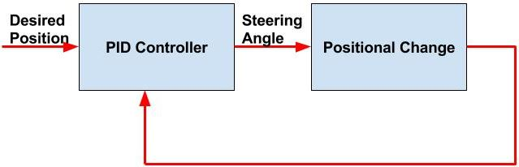
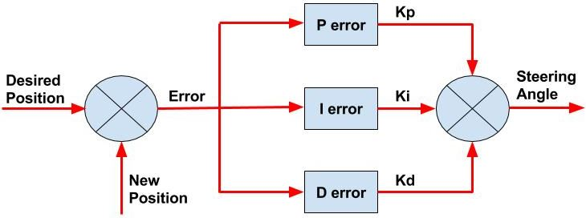
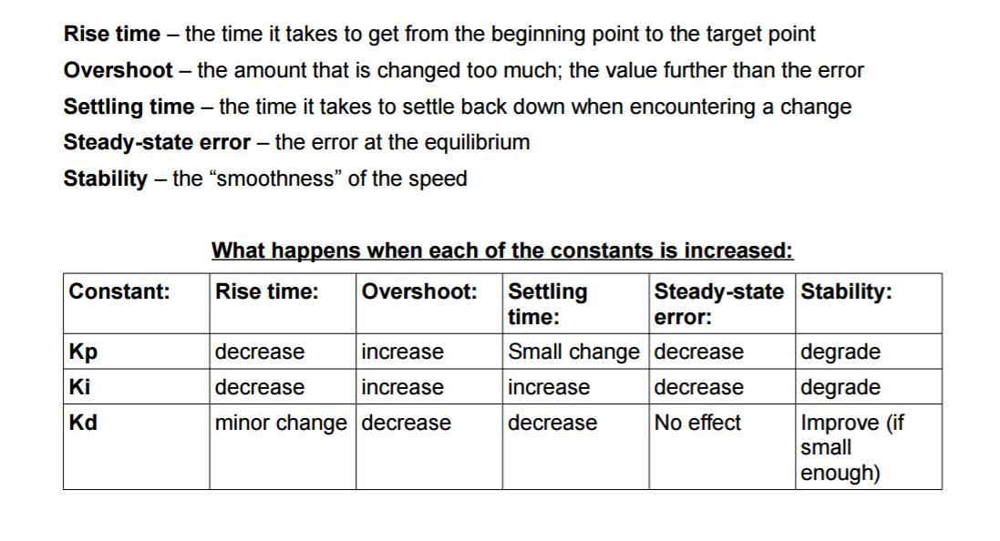

# Introduction
This project implements a C++ based PID (Proportional Integral Derivative) Controller to control the steering angle of the vehicle in a simulator. PID controllers have been around for a long time and it is commonly used to control a variable using a closed loop feedback system. The accuracy of control of a target variable is dependent on the values of the coefficients Kp, Ki, Kd of the 3 components.

## Project
The goal of this project is to implement a PID controller which controls the steering angle of a car in a simulator. Below is a block diagram which describes the flow.

<p align="center">
   
</p>
<p align="center">
   <i>Figure 1: PID Flow</i>
</p>

Here is the in-depth view of the PID controller block.

<p align="center">
   
</p>
<p align="center">
   <i>Figure 2: PID Controller</i>
</p>

The final equation which computes the steering angle is as follows.
```
steering_angle = -Kp * p_error -Ki * i_error -Kd * d_error
```

### Implementation
Below is the directory structure of this repository.

```
root
|   CMakeLists.txt
|   install-mac.sh
|   install-ubuntu.sh
|   README.md
|
|___data
|   |___images
|   |___simulator
|   
|___src
    |   json.cpp
    |   main.cpp
    |   PID.cpp
    |   PID.h
```

The brains behind the PID controller logic is in the two files PID.cpp/.h. The data folder contains images, vidoes and .txt files which are used in this report.

### Dependencies
* cmake >= 3.5
 * All OSes: [click here for installation instructions] (https://cmake.org/install/)
* make >= 4.1
  * Linux: make is installed by default on most Linux distros
  * Mac: [install Xcode command line tools to get make] (https://developer.apple.com/xcode/features/)
  * Windows: [Click here for installation instructions] (http://gnuwin32.sourceforge.net/packages/make.htm)
* gcc/g++ >= 5.4
  * Linux: gcc / g++ is installed by default on most Linux distros
  * Mac: same deal as make - [install Xcode command line tools] ( (https://developer.apple.com/xcode/features/)
  * Windows: recommend using [MinGW] (http://www.mingw.org/)
* [uWebSockets] (https://github.com/uWebSockets/uWebSockets)
  * Run either `./install-mac.sh` or `./install-ubuntu.sh`.
  * If you install from source, checkout to commit `e94b6e1`, i.e.
    ```
    git clone https://github.com/uWebSockets/uWebSockets
    cd uWebSockets
    git checkout e94b6e1
    ```
    Some function signatures have changed in v0.14.x. See [this PR] (https://github.com/udacity/CarND-MPC-Project/pull/3) for more details.
* Simulator. You can download these from the [project intro page] (https://github.com/udacity/self-driving-car-sim/releases) in the classroom.

### Basic Build Instructions
1. Clone this repo.
2. Make a build directory: `mkdir build && cd build`
3. Compile: `cmake .. && make`
4. Run it: `./pid`.

## Discussion
As mentioned earlier, the key to controlling a variable in the closed loop feedback are the coefficients of the individual components of PID. So tuning the coefficients is critical. In Udacity's PID lesson, the twiddle algorithm was discussed for tuning the coefficients. But, I also explored using Stochastic Gradient Descent for tuning the coefficients. First, I discuss how each of the individual components effect the output of the PID controller and then discuss how each algorithm tuned the coefficients.

### Components
#### Proportional component
As one can guess from the name, the proportional component affects the output of the controller directly based on the input (error) passed in. Therefore the proportional component has a strong effect on the output. No sensor is perfect, so the error passed in might not be the true error. This leads to overshoot beyond the target in either direction. The proportional component helps in reaching the target value but it tends to lead to oscillations around the target value without converging.

#### Integral component
The proportional component helps in reaching the target value but the error oscillation (even though small) around target value needs to be reduced to reach the target value. This is where the integral component helps. The integral component is the sum of the errors over time. So when the error is small, the integral component helps with reaching the target value in a relatively short amount of time because the integral is over the rate of change of time.

#### Derivative component
It seems like PI components should give us a pretty great controller to control a variable but a crucial component of having a stable controller is predicting error and incorporating that into the feedback system. The derivative component does just that, it calculates the future error based on the previous error and incorporates into the system. If there is a chance that the output of the controller will overshoot, the derivative component will help controlling the overshoot.

Here is a table from (http://smithcsrobot.weebly.com/uploads/6/0/9/5/60954939/pid_control_document.pdf), which perfectly  describes the effect on the output when each of the coefficients of the components is increased.

<p align="center">
   
</p>
<p align="center">
   <i>Figure 3: Coefficients Table</i>
</p>

### Algorithms
> **NOTE:**
> I didn't have enough time to use PID to tune the speed. In my project I set the throttle variable, in main.cpp, which controls speed to a fixed value of 0.15 because a bigger throttle value causes the car to swerve a lot.

#### Stochastic Gradient Descent (SGD)
The steering angle equation, as described earlier, is linear in nature and seemed like a perfect candidate for using SGD to tune the coefficients of the individual components of the PID controller. I actually implemented SGD first because it seemed the quickest way for me to test the PID controller.

The .txt file in the folder /data/simulator/SGD2Laps.txt has the tuned coefficients of the individual components after 2 laps.

The final values are as follows:

```Kp: 0.998902, Ki: -7.63173e-06,Kd: 0.0045926```

The order of highest weights assigned by the SGD algorithm was P->D->I. Assignment of lower weights to the 'I' component makes sense because the 'I' component accumulates errors and helps with reaching the target value. But the SGD based tuning assigns a lower weight to the derivative component and a higher weight to the proportional component. This leads to a lot of swerving of the car, this can be especially seen during the 2nd lap of the car in the simulator. Here is a gif (from SGD.mp4 in the data/simulator) which shows the swerving.

<p align="center">
   
</p>
<p align="center">
   <i>Figure 4: SGD Algorithm 2nd Lap</i>
</p>

The SGD algorithm can definitely be tuned to reduce the swerving by tweaking the learning rate, the number of epochs and also how often the algorithm is called.

#### Twiddle
Even though the SGD algorithm for tuning the coefficients works, the swerving of the car is definitely not ideal. So, I decided to implement the twiddle algorithm as well. The twiddle algorithm in a nutshell is described really well in this link: https://martin-thoma.com/twiddle/

The twiddle algorithm worked really well for this problem. The initial coefficient values to start the algorithm tuning mattered a lot in my implementation. I did have to manually play around with the initial and potential coefficient values to arrive at a working solution. The final coefficient values after 2 laps were:

```Kp: 0.225, Ki: 1e-05,Kd: 0.75```

The algorithm definitely hovers around the initial coefficient values for "I" and "D" components but increases the "P" component from it's initial value. Having a higher value assigned for the coefficient of the "D" component stabilizes the drive significantly. This is because the future error is accounted for, so the system is less prone to overshoot. Compared to the SGD algorithm based model, the swerving is reduced a lot with the twiddle model and the drive is relatively smoother. Below is a .gif (from Twiddle.mp4 in the data/simulator) which shows a smoother drive in the 2nd lap around the same portion.   

<p align="center">
   
</p>
<p align="center">
   <i>Figure 5: Twiddle Algorithm 2nd Lap</i>
</p>

## Final thoughts
1. The car can complete laps by just tuning the "P" component and disabling the "I" & D components.
2. The "I" & "D" components lead to a smoother drive because they help with converging to the target.
3. SGD works but doesn't lead to a smooth drive.
4. Twiddle works perfectly for this problem, leads a way smoother drive.
5. For twiddle, hyperparameters like the initial value of the coefficients, rate of change of coefficients and how often twiddle is called can be tuned to lead to optimized performance
5. PID control can be applied to control the speed of the vehicle as well. I wish I had more time to play around with that.
